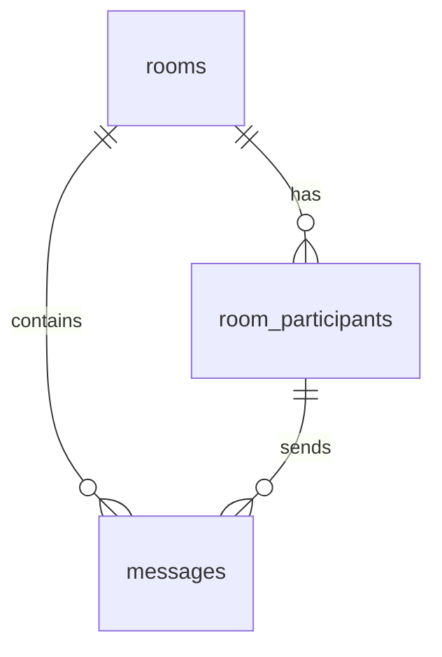

# Ghost Chat - Technical Documentation

## 01 – SYSTEM ARCHITECTURE

### 1.1 Application Overview
Ghost Chat is a privacy-first, 1:1, self-destructing chat platform designed to leave zero digital footprint. It prioritizes ephemeral communication without the need for accounts or long-term data storage.

- **Privacy-First**: No identity collection, no accounts, and no persistent chat logs.
- **1:1 Interaction**: Secure, single-use rooms for two participants only.
- **Self-Destructing**: Automated destruction of rooms and messages based on user-defined timers (up to 3 hours).
- **Real-Time Synchronization**: Instant message delivery via WebSockets (Supabase Realtime).
- **Multi-Device Interaction**: Optimized for mobile and desktop browsers with a "Privacy Mode" blur for glance protection.
- **Scalable Infrastructure**: Built on top of Supabase Edge Functions and PostgreSQL for rapid scaling.

### 1.2 Technology Stack

#### Frontend
- **Framework**: React (Vite) / TypeScript
- **Styling**: Tailwind CSS & shadcn/ui
- **State Management**: React Hooks & Context API
- **E2EE**: Web Crypto API (AES-GCM 256-bit)
- **Responsive UI**: Mobile-first architecture with glassmorphism aesthetics.

#### Backend
- **Platform**: Supabase
- **Edge Functions**: Deno (Node.js compatible) for room and message operations.
- **Authentication**: Anonymous, per-room session tokens (Custom implementation).
- **Real-Time**: Supabase Realtime (WebSockets) for message relay.

#### Infrastructure
- **Hosting**: Vercel (Frontend) / Supabase (Backend/Database)
- **Database**: PostgreSQL (Stateless/Ephemeral storage)
- **Notifications**: (Optional) FCM/APNS via Edge Functions (generic payloads only).

### 1.3 High-Level Architecture Diagram

```mermaid
graph TD
    subgraph Client Layer
        WebClientA["Sender (React)"]
        WebClientB["Recipient (React)"]
    end

    subgraph Application Layer (Edge)
        EF["Supabase Edge Functions"]
        AuthSvc["Anonymous Auth Service"]
        Crypto["Client-Side E2EE"]
    end

    subgraph Data Layer
        DB[("PostgreSQL")]
        Realtime["Supabase Realtime (WebSockets)"]
    end

    WebClientA -- "Action (create/join/send)" --> EF
    WebClientB -- "Action (join/send/get)" --> EF

    EF --> AuthSvc
    EF --> DB
    
    WebClientA -- "Encrypted Blob (Realtime)" --> Realtime
    Realtime -- "Relay" --> WebClientB

    WebClientA -.-> Crypto
    WebClientB -.-> Crypto
```

---

## 02 – DATABASE SCHEMA

### 2.1 Core Tables

| Table Name | Description | Key Columns |
| :--- | :--- | :--- |
| `rooms` | Active ephemeral chat rooms. | `id` (UUID), `code` (Text, Unique), `duration_minutes` (Int), `expires_at` (Timestamp), `status` (waiting/active/expired), `participant_count` (Int) |
| `messages` | Transient encrypted message blobs. | `id` (UUID), `room_id` (FK), `sender_id` (Session Token), `content` (Encrypted Base64), `image_url` (Encrypted Base64), `message_type` (text/image) |
| `room_participants` | Junction table for active participants. | `id` (UUID), `room_id` (FK), `session_token` (Unique Hash), `participant_number` (1 or 2) |

### 2.2 Relationship Summary



- **Ephemeral Storage**: Messages are physically deleted 1 hour after room expiry via a backend cron/cleanup function.
- **Anonymity**: No foreign keys to a traditional `users` table; authentication is scoped strictly to the room session.

---

## 03 – API SPECIFICATIONS

### 3.1 Authentication
- **Anonymous Session Tokens**: Securely generated 64-character hex strings assigned upon creating or joining a room.
- **Access Control**: Row Level Security (RLS) in Supabase ensures participants can only read/write messages within their active room using the `x-session-token` header.

### 3.2 Base URL
- **Development**: Localhost:54321
- **Production**: Project specific Supabase URL (`https://[PROJECT_ID].supabase.co/functions/v1`)
- **Versioned API**: Logic encapsulated within the `room-operations` edge function.

### 3.3 Core Endpoints (Edge Function Actions)

#### Authentication & Onboarding
- `POST /room-operations { action: 'create', durationMinutes: N }`: Generates 6-character code and session token for participant 1.
- `POST /room-operations { action: 'join', code: 'ABCDEF' }`: Validates code and generates session token for participant 2.

#### Dashboard / Room Info
- `POST /room-operations { action: 'get', code: '...', sessionToken: '...' }`: Retrieves current room status and expiration.

#### Messages
- `POST /room-operations { action: 'sendMessage', ... }`: Submits an E2EE blob (text or image) to the room.
- `POST /room-operations { action: 'getMessages', ... }`: Securely retrieves historical messages for initial room hydration.

### 3.4 Error Responses
Standardized for the `room-operations` wrapper:
- **400 Bad Request**: Invalid inputs or room full.
- **401 Unauthorized**: Missing or invalid session token for the target room.
- **404 Not Found**: Room code does not exist or has already expired.

### 3.5 Rate Limiting
- **Global Limit**: 100 requests per IP per 15 minutes.
- **Room Creation**: Limited to 5 rooms per IP per hour to prevent abuse.

---

## 04 – INTEGRATION REQUIREMENTS

### 4.1 Apple Watch Integration
- **Concept**: Future support for health-status notifications and heartbeat-based "Are you active?" chat signals.
- **Privacy Core**: All health data is processed on-device; only anonymized and encrypted signals reach the relay server.

### 4.2 Stripe Integration
- **Premium Upgrades**: One-time payments to extend chat duration from 3 hours to 12 or 24 hours.
- **Anonymous Payments**: Use Stripe's `Checkout Session` to handle PII, ensuring payment identities are never cross-referenced with ephemeral chat sessions.

### 4.3 SendGrid Email Templates
- **Invite Alerts**: Generic emails stating "Someone has invited you to a Ghost Chat."
- **No Content Policy**: Neither the room code nor any message content is included in email notifications.

### 4.4 Push Notifications (FCM/APNS)
- **Generic Alerts**: Notifications are limited to fixed strings: "You have an update in the app."
- **Payload Security**: No metadata (sender ID, room ID) is exposed in the push payload.

---

## 05 – DATA SYNCHRONIZATION

### 5.1 Real-Time Requirements
Ghost Chat relies on the Supabase Realtime engine for instant delivery.
- **WebSocket Protocol**: Secure transport via `wss://`.
- **Latency Target**: < 100ms for message relay between connected participants.

### 5.2 Offline Support
- **Session Cache**: The 6-character room code and E2EE session token are stored in `sessionStorage` (cleared on tab close).
- **Transient Buffering**: Small local buffer for messages attempting to send while connectivity is intermittent.
- **Auto-Reconnect**: Exponential backoff logic to resume WebSocket connection on network restoration.

### 5.3 Background Sync
- **Self-Destruction Logic**: Background processes on the server monitor the `expires_at` timestamp.
- **Hard Wipe**: When a room expires, a dedicated worker triggers the erasure of all associated messages and participant tokens.

---

## 06 – SECURITY & COMPLIANCE

### 6.1 Authentication & Authorization
- **JWT-Free Anonymous Access**: Authentication is handled by cryptographically secure session tokens scoped to a single room.
- **RLS Enforcement**: Supabase Row Level Security ensures only the two participants with the correct session tokens can access the room's message stream.

### 6.2 Data Encryption
- **In-Transit**: Mandatory TLS 1.3 for all client-server communication.
- **At-Rest (None)**: Content is encrypted on the client side; the database only stores encrypted blobs of cipherText.
- **E2EE Model**: AES-GCM (v1) derived from the room code. Future iterations plan for P2P key negotiation (X3DH).

### 6.3 GDPR Compliance
- **Right to Erasure**: Built-in as the primary feature. All user data is destroyed by default after the session ends.
- **Data Minimization**: No personal data (emails, IPs, Geolocation) is collected or stored persistently.

### 6.4 PCI Compliance
- **Financial Security**: All financial transactions are offloaded to Stripe; Ghost Chat never directly handles or stores cardholder data.
- **Secure Webhooks**: Mandatory signature verification for all external integration callbacks.

---

## 07 – PERFORMANCE REQUIREMENTS

### 7.1 Response Time Targets
- **Room Operations**: < 300ms (Create/Join/Get).
- **Message Relay**: < 100ms (P95 latency via WebSockets).
- **E2E Encryption Delay**: < 50ms (Client-side crypto overhead).

### 7.2 Scalability Targets
- **Year 1 (MVP)**: Support up to 10k rooms/day and 100 concurrent rooms.
- **Post Launch**: Target 100k+ concurrent users via horizontal scaling of Supabase Edge Functions.
- **Long-term**: Architecture designed for 1M+ users using distributed WebSocket gateways.

### 7.3 Database Optimization
- **Minimal Indexing**: Indexes are limited to `code` and `expires_at` for efficient lookup and cleanup.
- **Auto-Vacuums**: Frequent PostgreSQL vacuuming to handle the high-churn nature of ephemeral data.
- **Memory-First**: Prioritize in-memory metadata handling on Edge nodes to minimize DB round-trips.

---

## 08 – MONITORING & LOGGING

### 8.1 Application Monitoring
- **Error Tracking**: Sentry integration for real-time frontend and edge function error reporting.
- **Performance Metrics**: Monitoring function execution times and socket connection health via Supabase Metrics.
- **Generic Metrics**: CPU/Memory usage of Edge instances; DB connection pool saturation.

### 8.2 Logging Standards
- **Structured JSON Logs**: Logs include `timestamp`, `service`, `event_type`, and `request_id`.
- **Anonymity Policy**: Logs NEVER contain room codes, session tokens, or message previews.
- **Sensitive Masking**: Automatic stripping of IP addresses and device identifiers to maintain untraceability.

---

## 09 – TESTING REQUIREMENTS

### 9.1 Unit Testing
- **E2EE Logic**: Full coverage for `encryptMessage` and `decryptMessage` using various payloads and edge-case codes.
- **Edge Logic**: Mocked Supabase environment to test room state transitions (waiting -> active -> expired).

### 9.2 Integration Testing
- **Room Lifecycle**: Automated scripts to verify that a room created at T=0 is correctly destroyed at T=Duration.
- **Realtime Logic**: Verification of message delivery between two mocked socket clients.

### 9.3 E2E Testing
- **User Journey**: Automated browser tests (Playwright) covering:
  - Create Room -> Share Code
  - Join Room -> Key Exchange
  - Send/Receive Text & Images -> Timer Expiry -> Kickout.

### 9.4 Performance Testing
- **Load Testing**: Stress testing the Edge Function with 1000+ concurrent Join requests.
- **Socket Saturation**: Verifying the maximum number of concurrent message relays per Edge instance.

---

## 10 – DEPLOYMENT & CI/CD

### 10.1 Deployment Strategy
- **Frontend**: Automated deployments via Vercel triggered by Git pushes to the `main` branch.
- **Backend**: Supabase Edge Functions deployed via Supabase CLI.
- **Environment Parity**: Strict separation between `local`, `staging`, and `production` Supabase projects.

### 10.2 Database Migrations
- **Version Control**: All schema changes are tracked via Supabase migrations in the `/supabase/migrations` directory.
- **Automated Workflows**: GitHub Actions to validate migrations against a shadow database before production rollout.

### 10.3 Feature Flags
- **Environment Config**: Use of environment variables (`VITE_ENABLE_GALLERY`, `VITE_DEBUG_MODE`) to toggle experimental features.
- **Gradual Rollout**: Config-driven flags to enable E2EE v2 or P2P modes for selected room codes.

---

## 11 – EDGE CASES & ERROR HANDLING

### 11.1 Connection Edge Cases
- **One Participant Leaves**: The room remains active until the timer expires or the second participant leaves.
- **Network Drops**: Clients attempt to reconnect for 30s. If the room has expired during the disconnect, the user is redirected to the home screen upon reconnection.

### 11.2 Logic Error Handling
- **Invalid Room Code**: Simple, non-descriptive error: "Room not found or no longer available."
- **Full Room**: Attempting to join a room with 2 active participants returns a "Room is full" error.
- **Decryption Failure**: If a client lacks the correct key material, the message is rendered as: `[Unable to decrypt message]`.

### 11.3 Data Sync Conflicts
- **Sequential Relay**: Since the app is a 1:1 stream, conflicts are minimal. Messages are relayed in the order they reach the Edge Function.
- **Timestamp Disputes**: Server-side `created_at` timestamps are the single source of truth for message ordering.

---

## 12 – FUTURE CONSIDERATIONS

### 12.1 Planned Features (Not in MVP)
- **True P2P Mode**: Using WebRTC to exchange messages directly between browsers, bypassing the relay server for even higher privacy.
- **Custom Nicknames**: Allow users to set a temporary, non-stored nickname for the duration of the room.
- **Rich Media**: Encrypted voice memos and disappearing "view-once" photos.

### 12.2 Scalability Roadmap
- **Phase 1 (Current)**: Single-region Supabase deployment.
- **Phase 2**: Global Edge Function distribution (Supabase Fly-enabled regions) to reduce latency for international users.
- **Phase 3**: Decoupled WebSocket fleet using a custom Node.js cluster for massive concurrency.

---

## 📎 APPENDIX

### A. Glossary
- **E2EE**: End-to-End Encryption. Content is only ever readable by the sender and recipient.
- **Relay**: The server's role in forwarding encrypted data without access to the keys.
- **Ephemeral**: Data that exists only in memory or for a strictly limited duration.
- **AES-GCM**: Advanced Encryption Standard in Galois/Counter Mode, used for secure authenticated encryption.

### B. External Dependencies
| Dependency | Purpose | Criticality |
| :--- | :--- | :--- |
| **Supabase** | Backend/Auth/Database | High |
| **Vercel** | Frontend Hosting | High |
| **Web Crypto API**| Browser-native encryption | High |
| **Lucide React** | UI Iconography | Low |

### C. API Versioning Strategy
- **Action-Based Versioning**: The `room-operations` edge function handles versioning through a `version` field in the request body (defaulting to `v1`).
- **Backward Compatibility**: New fields in the message blob are ignored by older clients until they refresh.


## 13 – CRYPTO INTEGRATION

### 13.1 Overview
Ghost Chat includes a privacy-preserving crypto wallet integration allowing users to send and receive real cryptocurrency (MATIC/ETH) directly within the chat.

### 13.2 Wallet Support
- **External Wallets**: Supports MetaMask, Phantom, and other WalletConnect-compatible wallets for mainnet interactions.
- **Ephemeral Wallets ("Burner Wallets")**:
  - In-browser generated wallets for users without extensions.
  - Keys stored in `sessionStorage` (cleared on tab close/room expiry).
  - "Privacy Mode": Users can burn the wallet to permanently destroy keys and history.

### 13.3 Payment Flow
1. **Connect**: User A connects wallet (or generates burner).
2. **Signal**: Wallet address is shared via encrypted system message to User B.
3. **Send**: User B clicks "Send Crypto", enters amount.
4. **Sign**: User B signs transaction on Polygon or Base Mainnet.
5. **Verify**: Transaction hash is sent to chat; User A verifies on block explorer.

### 13.4 Security Model
- **Client-Side Only**: Private keys never touch the server.
- **No Indexing**: Wallet addresses are not stored in the database, only relayed via E2EE messages.
- **Mainnet Only**: Configured for Polygon (137) and Base (8453) mainnets for real value transfer.
